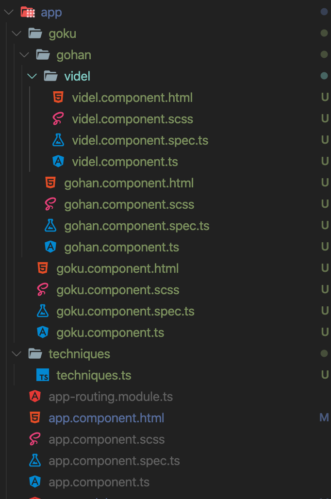
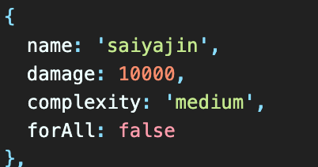

# Sesión 2 - Angular | Ejercicios


Todos conocemos la mítica serie de Akira Toriyama y sabemos que Goku es el padre de Gohan y que Gohan es el padre de Videl que a su vez es la nieta de Goku... Pero espera esto qué tiene que ver con el ejercicio de hoy? Pues hoy hemos visto las directivas de Angular y la comunicación entre padre e hijos y por ello os proponemos un ejercicio con Dragon Ball.

Para nuestro ejercicio tendremos la siguiente estructura:



Dentro del fichero de **techniques.ts** tendremos un listado de objetos con diversas técnicas, como bien sabéis  **Goku** puede aprender todas las técnicas y por ello en el **goku.component.html** debemos pintar el listado completo. Para ello utilizaremos la directiva adecuada, además en la template debemos comprobar que nos llegan valores.


Por el contrario **Gohan** solo puede aprender algunas técnicas, las que tienen un nivel de dificultad medium:



Las técnicas que aprenda Gohan se las enseñara Goku y para ello utilizaremos los **inputs**, el componente Goku transfiere técnicas a Gohan. Por otro lado cuando pintemos el listado de ténicas en Gohan debemos pintar un botón en cada una de ellas, que al clickarlo le comunique a Goku que Gohan ha aprendido una nueva técnica.

Cuando Goku recibe el **output** con el mensaje de "Gohan ha aprendido una nueva técnica + nombre técnica", en la template de Goku se ha de pintar:


Y qué sucede con Videl? pues que la pobre tan sólo podrá aprender técnicas con un nivel de dificultad low, además estas técnicas se las enseñará Gohan a través de inputs. Y al igual que pasaba con Gohan Videl ha de informarle que la ha aprendido y este a su vez a Goku que Videl aprendió dicha técnica. Por lo que Gohan será un intermediario entre Goku y Videl.

**BONUS**:

1. Añade una imagen a la interfaz y cuando Gohan aprenda una técnica haz que cambie dicha imagen.

```tsx
{
    name: 'onda vital',
    damage: 400,
    complexity: 'low',
    forAll: true,
    image: 'url...'
  }
```

2. Desde cero añade nuevos personajes que aprendan técnicas y se las trasmitan a otros. Por ejemplo haz una prueba creando el componente Vegeta que enseña al componente Trunks.

3. Añade en cada componente una foto, nombre de personaje y descripción (recuerda tiparlo con una interfaz) y pinta dicha info en cada uno de los componentes.