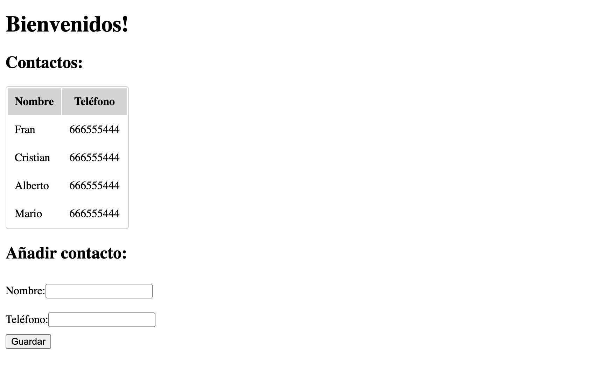

# Angular Sesión 8 - Ejercicios

En esta sesión vamos a pone en práctica lo que has aprendido sobre testing.

Para ello te entregamos en este repo una pequeña aplicación de Angular funcionando, como puedes ver es una pequeña agenda o listín telefónico:

Como observarás en el  código se encuentran funciones para guardar contactos, pero todo un poco "rudimentario". Vamos a mejorarlo un poco!

Para ello debes llevar a cabo los siguientes desarrollos:

### 1. **Añadir ID a cada contacto**

Los contactos deben tener un ID para poder trabajar más cómodamente. Añade el campo ID de tipo numérico a los contactos existentes y haz que a partir de ahora cada vez que se cree un contacto, el servicio le asigne un ID numérico único

### 2. Añadir función de borrado

Como habrás observado ahora mismo no se puede borrar contactos desde el componente. Añade un botón en cada fila que permita borrar el contacto.

Desde el componente se deberá llamar a un método del servicio para realizar el borrado, este método recibirá el ID del contacto a borrar.

### 3. Permitir la edición de contactos

Realizar un método en el servicio que permita editar un contacto, el  método recibirá el ID del contacto a modificar y los nuevos valores.

Añade en el componente un botón para modificar un contacto. Al pulsar el botón se cargarán los datos actuales en un formulario, si pulsamos en guardar, se deberán mandar los datos al servicio.

### 4. Añade tests unitarios para todos los métodos del servicio

Deberás realizar tests unitarios para validar las siguientes operaciones:

- Recuperar la lista de contactos
- Añadir un contacto
- Eliminar un contacto
- Editar un contacto

### **BONUS**

Realiza tests para el componente. Como puedes ver tenemos un test para comprobar la creación de contactos dede el componente.

Testea el resto de funcuonalidades:

- Listado de contactos
- Borrado
- Edición